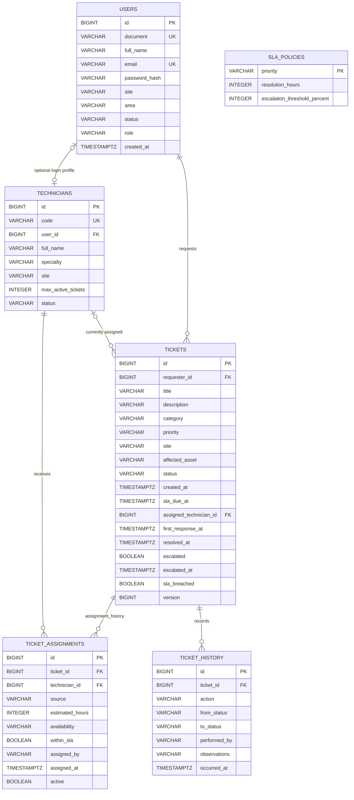

# HelpFlow Entity Relationship Diagram

The diagram reflects Flyway migrations V1–V3. Enum-like values are stored as strings. Dispatch has no persistence schema.

```mermaid
erDiagram
    USERS {
      BIGINT id PK
      VARCHAR document UK
      VARCHAR full_name
      VARCHAR email UK
      VARCHAR password_hash
      VARCHAR site
      VARCHAR area
      VARCHAR status
      VARCHAR role
      TIMESTAMPTZ created_at
    }
    TECHNICIANS {
      BIGINT id PK
      VARCHAR code UK
      BIGINT user_id FK
      VARCHAR full_name
      VARCHAR specialty
      VARCHAR site
      INTEGER max_active_tickets
      VARCHAR status
    }
    TICKETS {
      BIGINT id PK
      BIGINT requester_id FK
      VARCHAR title
      VARCHAR description
      VARCHAR category
      VARCHAR priority
      VARCHAR site
      VARCHAR affected_asset
      VARCHAR status
      TIMESTAMPTZ created_at
      TIMESTAMPTZ sla_due_at
      BIGINT assigned_technician_id FK
      TIMESTAMPTZ first_response_at
      TIMESTAMPTZ resolved_at
      BOOLEAN escalated
      TIMESTAMPTZ escalated_at
      BOOLEAN sla_breached
      BIGINT version
    }
    TICKET_ASSIGNMENTS {
      BIGINT id PK
      BIGINT ticket_id FK
      BIGINT technician_id FK
      VARCHAR source
      INTEGER estimated_hours
      VARCHAR availability
      BOOLEAN within_sla
      VARCHAR assigned_by
      TIMESTAMPTZ assigned_at
      BOOLEAN active
    }
    TICKET_HISTORY {
      BIGINT id PK
      BIGINT ticket_id FK
      VARCHAR action
      VARCHAR from_status
      VARCHAR to_status
      VARCHAR performed_by
      VARCHAR observations
      TIMESTAMPTZ occurred_at
    }
    SLA_POLICIES {
      VARCHAR priority PK
      INTEGER resolution_hours
      INTEGER escalation_threshold_percent
    }
    USERS o|--|o TECHNICIANS : "optional login profile"
    USERS ||--o{ TICKETS : requests
    TECHNICIANS o|--o{ TICKETS : "currently assigned"
    TICKETS ||--o{ TICKET_ASSIGNMENTS : assignment_history
    TECHNICIANS ||--o{ TICKET_ASSIGNMENTS : receives
    TICKETS ||--o{ TICKET_HISTORY : records
```
