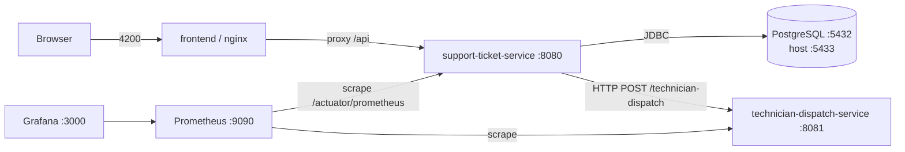

# HelpFlow Deployment and Service Relationships

Ports are published by `docker-compose.yml` with the defaults shown. Containers communicate over the Compose network using service names.

```mermaid
flowchart LR
  browser[Browser] -->|4200| frontend["frontend / nginx"]
  frontend -->|proxy /api| support["support-ticket-service :8080"]
  support -->|JDBC| db[("PostgreSQL :5432<br/>host :5433")]
  support -->|HTTP POST /technician-dispatch| dispatch["technician-dispatch-service :8081"]
  prom["Prometheus :9090"] -->|scrape /actuator/prometheus| support
  prom -->|scrape| dispatch
  grafana["Grafana :3000"] --> prom
```
